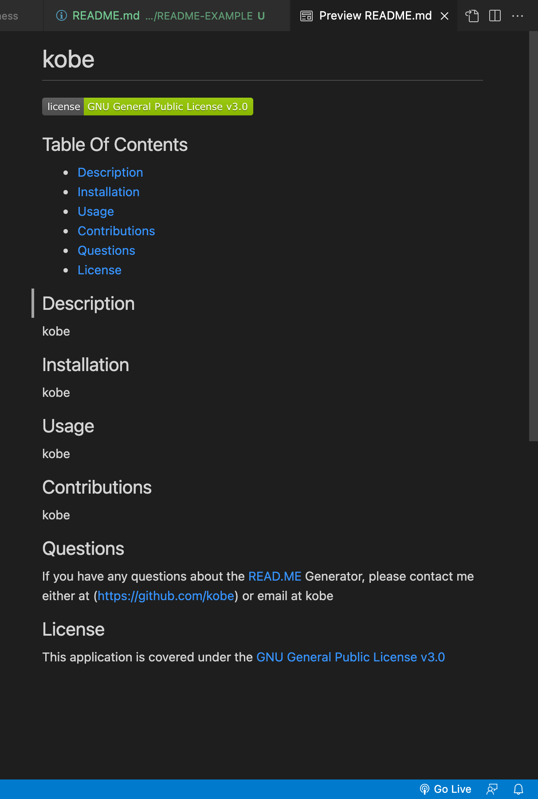

# README.md Generator
    

    
## Table Of Contents
- [Description](#Description)
- [Installation](#Installation)
- [Usage](#Usage)
- [Contributions](#Contributions)
- [Questions](#Questions)
- [License](#License)

## Description
This project will give you a good readme depending on the information you put inside of the terminal.

## Installation
to install this project all you need to do is "npm i inquirer". Once you have that package you can go inside of the terminal and type node index.js

## Usage
After installing the inquirer all you need to do is go inside of the terminal and type node index.js

## Contributions
He may not know but I did sneak a look at Micheal Wests github just to help my self.

## Picture of Generated README.md

## Questions
If you have any questions about the READ.ME Generator, please contact me either at (https://github.com/koberobinson) or email at koberobinson02@gmail.com

## License
This application is covered under the [MIT License](https://opensource.org/licenses/MIT)

## README.md Generator Video
Link to the video: https://watch.screencastify.com/v/LDig9NwiVFocHkAW6lOg
  